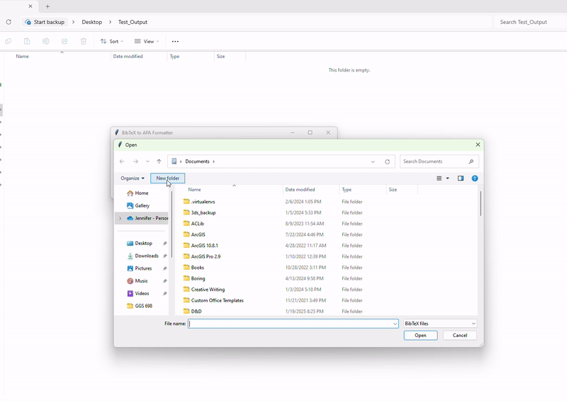

# BibTeX to APA Formatter

A Python-based tool to categorize and format `.bib` files into APA-style `.docx` files for **publications**, **conferences**, and **patents**. This tool includes a simple GUI for ease of use.

 

---

## Features
- **Categorize Entries**: Automatically separates entries into **publications**, **conferences**, and **patents**.
- **APA Formatting**: Formats entries in APA style, with proper italicization for journal and conference names.
- **Customizable Output**: Choose which sections (publications, conferences, patents) to include in the output.
- **User-Friendly GUI**: Select your `.bib` file and output directory with ease.

---

## How to Use

### 1. **Install Dependencies**
Ensure you have Python installed. Then, install the required libraries:
```bash
pip install bibtexparser python-docx
```
### 2. Run the Executable
1. Download the `.exe` file from the `main` folder.
2. Double-click the `.exe` file to launch the GUI.

### 3. Using the GUI
1. **Select a `.bib` File**: Click "Browse" to choose your `.bib` file.
2. **Choose Output Directory**: Select the folder where the output `.docx` files will be saved.
3. **Toggle Sections**: Check the boxes to include **publications**, **conferences**, and/or **patents**.
4. **Process**: Click "Process" to generate the APA-formatted `.docx` files.

---

## Output Files
The tool generates the following files in the output directory:
- `publications.docx`: APA-formatted publications.
- `conferences.docx`: APA-formatted conference entries.
- `patents.docx`: APA-formatted patent entries.

---

## License

This project is licensed under the **MIT License**. See the [LICENSE](https://github.com/Seren-Smith/BibTex-to-APA/blob/main/LICENSE).

---

## Support Me

If you find this tool useful, consider supporting me on Ko-Fi! Your support helps me create more open-source tools and resources.

[](https://ko-fi.com/serensmith) 

--- 

## Contributing

Contributions are welcome! If you have suggestions, bug reports, or feature requests, please open an issue or submit a pull request.

---

## Acknowledgements

- **bibtexparser** for parsing '.bib' files.
- **python-docx** for creating '.docx' files.
- **Tkinter** for the GUI.

Enjoy using the **BibTeX to APA Formatter**! If you have any questions or feedback, feel free to reach out.  
